# Шаблон верстки (Pug + SCSS + Gulp)

## Структура шаблона

* `[app]`*Корень нашего локального сервера на время разработки*
* `[build]`*Папка для в которую собираются минифицированные файлы из папки [app] для продакшена*
* `[design]`
* `[dev]`
    * `[blocks]`*Папка для хранения блоков и компонентов*
        * `[_assets]`*Отдельно подключаемые библиотеки*
        * `[_base]`
        * `[_core]`
        * `[button]`
        * `[form]`
        * `[list]`
        * `[nav]`
        * `[table]`
* `[fonts]`
* `.bowerrc`
* `.gitignore`
* `gulpfile.js`
* `package.json`
* `README.md`

## Плагины Gulp

* [gulp-concat-css](https://www.npmjs.com/package/gulp-concat-css) - Для склеивания _CSS-файлов_ подключаемых библиотек
* [gulp-clean-css](https://www.npmjs.com/package/gulp-clean-css) - Минификация файлов стилей для продакшена
* [gulp-notify](https://www.npmjs.com/package/gulp-notify/) - Плагин для уведомлений
* [gulp-autoprefixer](https://www.npmjs.com/package/gulp-autoprefixer/) - Для автоматической подстановки _CSS-префиксов_
* [gulp-connect](https://www.npmjs.com/package/gulp-connect/) - Локальный сервер вместе с `live-reload`
* [gulp-sass](https://www.npmjs.com/package/gulp-sass/) - Для работы с `SASS/SCSS`
* [gulp-pug](https://www.npmjs.com/package/gulp-pug) - Для работы с `Pug/Jade`
* [gulp-plumber](https://www.npmjs.com/package/gulp-plumber) - Чтобы всякий раз не вылетал, при возникновении ошибки
* [gulp-uglify](https://www.npmjs.com/package/gulp-uglify) - Для минификации _JS-файлов_
* [gulp-sftp](https://www.npmjs.com/package/gulp-sftp) - Для отправки по `FTP` на сервер
* [gulp-clean](https://www.npmjs.com/package/gulp-clean) - Для удаления файлов

**Неиспользуемые плагины :**

* [gulp-rename](https://www.npmjs.com/package/gulp-rename/) - Для переимееновывания получаемых файлов
* [gulp-uncss](https://www.npmjs.com/package/gulp-uncss/) - Удаление неиспользуемых _CSS-стилей_
* [gulp-less](https://www.npmjs.com/package/gulp-less/) - Работа с `LESS`
* [gulp-rev-append](https://www.npmjs.com/package/gulp-rev-append/) - Плагин для кэширования
* [gulp-useref](https://www.npmjs.com/package/gulp-useref) - Для подготовки проекта к отправке в продакшн
* [gulp-if](https://www.npmjs.com/package/gulp-if) - Фильтрует подключенные к `index.html` файлы

## Плагины для SublimeText

* [WebInspector](https://github.com/sokolovstas/SublimeWebInspector) - Мощный инструмент для дебаггинга JavaScript, полноценный инспектор кода для Sublime. Фичи: установка брейкпоинтов прямо в редакторе, показ интерактивной консоли с кликабельными объектами, остановка с показом стек трейса и управление шагами дебаггера. Все это работает на ура!
[]
* [Fireplay](https://github.com/mozilla/fireplay-sublime) - Плагин от Mozilla, который позволяет подключаться к Firefox Developer tools.
* [JSHint](https://github.com/uipoet/sublime-jshint) - максимально простой дебаггер
* [Emmet](http://emmet.io/) - Один из самых популярных плагинов для редакторов. Emmet, бывший Zen Coding, является также одним из самых значительных методов повышения продуктивности веб-разработчиков. После нажатия на табуляцию Emmet преобразует простые сокращения в объемные фрагменты кода для HTML и CSS. 
* [Hayaku](https://github.com/hayaku/hayaku) - коллекция удобных аббревиатур для каскадных стилей с emmet.
* [Git](https://github.com/kemayo/sublime-text-git) - Суть этого плагина понятна из названия — возможность работать с Git прямо в вашем любимом редакторе. Данный способ работы с Git позволит вам сэкономить массу времени. Во-первых: вам не придется постоянно переключаться между окнами Sublime и терминала. Во-вторых: есть грамотный автокомплит и вместо git add -A, достаточно написать add. В-третьих: существуют такие мелочи как Quick commit, который одной командой quick добавляет все изменения и коммитит их.
* [Glue](https://github.com/chrissimpkins/glue) - выводит внизу небольшое окошко, где можно писать на Shell. Благодаря этому из редактора теперь будет доступен не только Git…
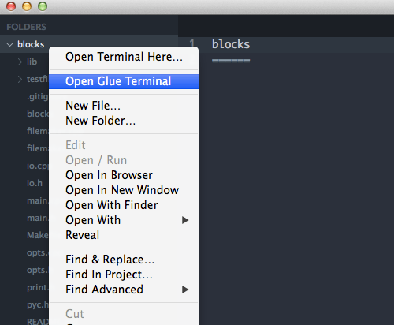
* [GitGutter](https://github.com/jisaacks/GitGutter) и [Modific](https://github.com/gornostal/Modific) - Данные плагины подсвечивают строки измененные последним коммитом, другими словами diff tools в режиме реального времени.
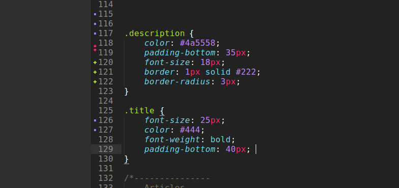
* [BracketHighlighter](https://packagecontrol.io/packages/BracketHighlighter) - Мега круто! Открытие и закрытие любого фрагмента в коде должно выглядеть именно таким образом.
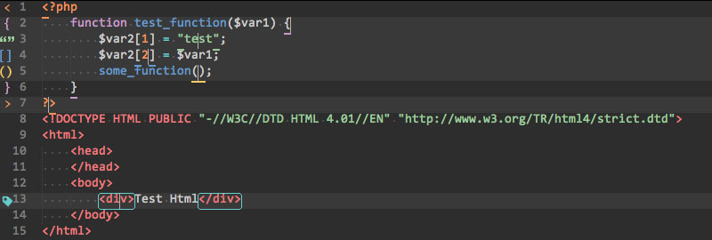
* [EditorConfig](https://github.com/sindresorhus/editorconfig-sublime) - Суть этого плагина заключается в том, чтобы предоставить возможность разработчиком иметь единый формат настроек для всех редакторов/IDE и всех языков программирования. Файлы .editorconfig хранят в себе информацию о табуляции, ширине отступа, кодировке и прочих конфигурациях.
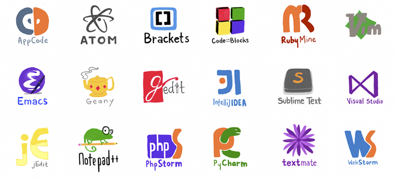
* [Sublimall](https://sublimall.org/) - Замечательный плагин, который синхронизирует все конфигурации (настройки, плагины, рабочие файлы) между вашими Sublime Text редакторами. Все абсолютно бесплатно, требуется только создать аккаунт.
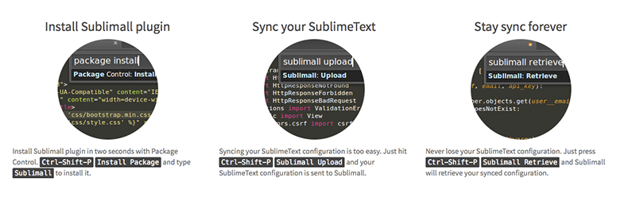
* [BufferScroll](https://github.com/titoBouzout/BufferScroll) - Более простая альтернатива.
* [AllAutocomplete](https://github.com/alienhard/SublimeAllAutocomplete) - Классическое автодополнение в Sublime Text работает только с текущим файлом. AllAutocomplete осуществляет поиск по всем файлам открытым в текущем окне, что значительно упрощает процесс разработки.
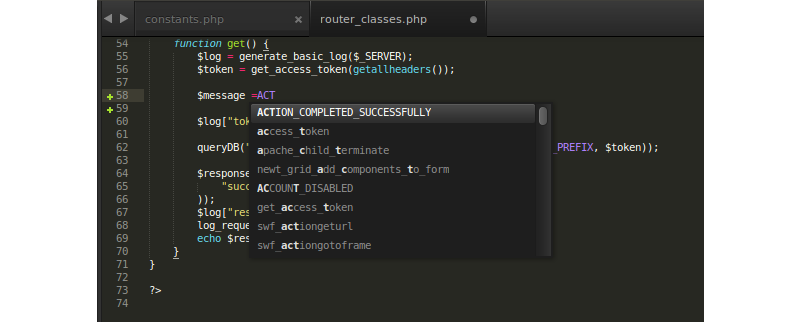
* [CodeIntel](https://github.com/SublimeCodeIntel/SublimeCodeIntel) - Также существует плагин CodeIntel, который воплощает в себе возможности IDE и помимо умного автокомплита привносит в Sublime «Code Intelligence» для ряда языков: JavaScript, Mason, XBL, XUL, RHTML, SCSS, Python, HTML, Ruby, Python3, XML, Sass, XSLT, Django, HTML5, Perl, CSS, Twig, Less, Smarty, Node.js, Tcl, TemplateToolkit, PHP.
* [SublimeREPL](https://github.com/wuub/SublimeREPL) - Вероятно, один из самых полезных плагинов для разработчиков. SublimeREPL позволяет прямо в редакторе интерпретировать целое множество языков: Clojure, CoffeeScript, F#, Groovy, Haskell, Lua, MozRepl, NodeJS, Python, R, Ruby, Scala, shell.
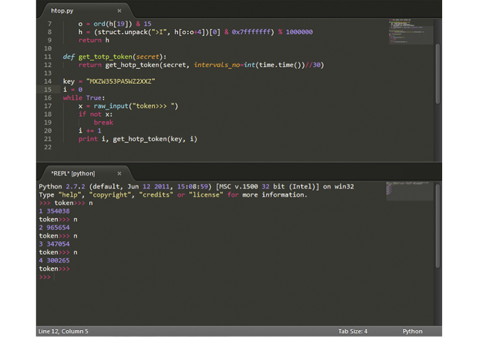
* [DocBlockr](https://github.com/spadgos/sublime-jsdocs) - DocBlockr станет для вас эффективным помощником при документировании кода. После ввода /** и нажатия на клавишу Tab плагин автоматически распарсит любую функцию и подготовит соответствующий шаблон.
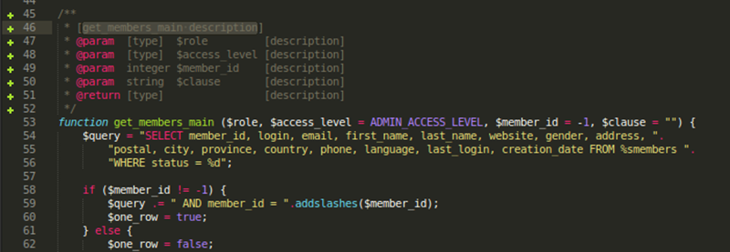
* [Floobits](https://floobits.com/) - Потрясающее расширение для SublimeText, Vim, Emacs, IntelliJ IDEA, которое позволяет разработчикам совместно работать на кодом, причем из разных редакторов.
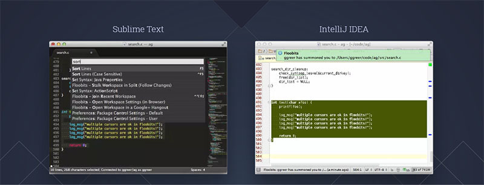
* [AutoFileName](https://github.com/BoundInCode/AutoFileName) - Автозаполнение путей к подключаемым файлам — очень удобно. Без лишних слов.
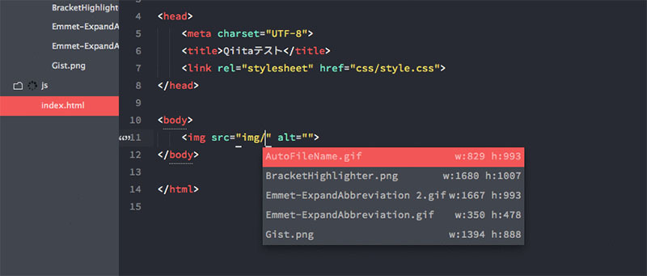
* [ColorPicker](http://weslly.github.io/ColorPicker/) - Обычно, когда нам требуется цветовая палитра мы привыкли использовать Photoshop или Gimp. Но полноценный color picker может быть прямо в окне вашего редактора — Ctrl/Cmd + Shift + C. А еще есть замечательные [GutterColor](https://github.com/ggordan/GutterColor) и [ColorHighlighter](https://github.com/Monnoroch/ColorHighlighter), которые упрощают ориентирование в цветовых кодах:
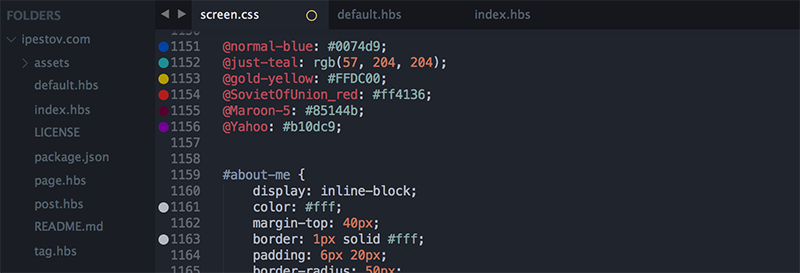
* [Colorcoder](https://github.com/vprimachenko/Sublime-Colorcoder) - Разукрашивает все переменные, тем самым значительно упрощая ориентацию в коде. Особенно полезно для разработчиков с дислексией.
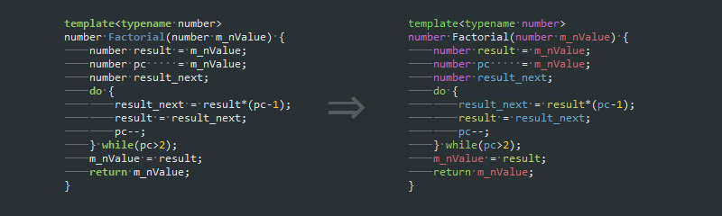
* [PlainTasks](https://github.com/aziz/PlainTasks) - Великолепный задачник! Все таски хранятся в файлах, поэтому их очень удобно сопоставлять с проектами. Возможность создавать проекты, указывать теги, выставлять даты. Грамотный интерфейс и шорткаты.

* [MarkdownEditing](https://github.com/ttscoff/MarkdownEditing) - Вероятно лучший плагин для работы с Markdown: подсветка, сокращения, автодополнение, цветовые схемы и др. Как альтернативно решение, можно попробовать [MarkdownPreview](https://github.com/revolunet/sublimetext-markdown-preview).
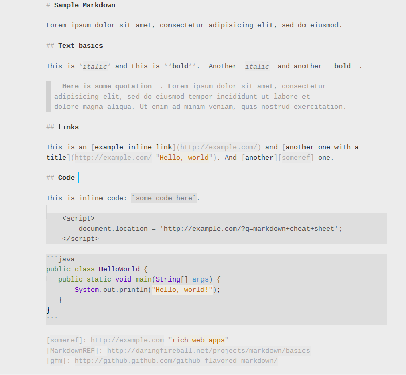
* [JavaScript Next](https://sublime.wbond.net/packages/JavaScriptNext%20-%20ES6%20Syntax) - плагин, подсвечивающий синтаксис лучше, чем стандартный JavaScript-хайлайтер. К тому же этот плагин поддерживает фичи EcmaScript 6, такие как модули, классы, генераторы и многое другое.
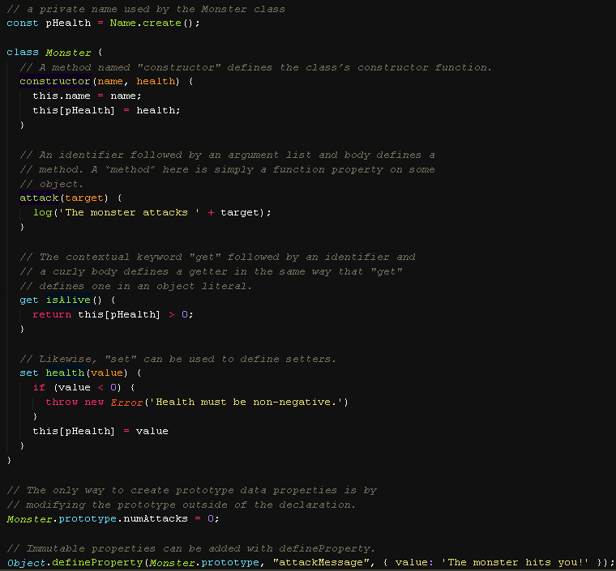
* [CSS3](https://sublime.wbond.net/packages/CSS3) - Плагин CSS3 обеспечивает подсветку для каждой фичи из спецификации CSS3. Это значит, что вы можете использовать любые возможности CSS3 — даже те, которые реализованы ещё не в полной мере — и они будут корректно подсвечены плагином.
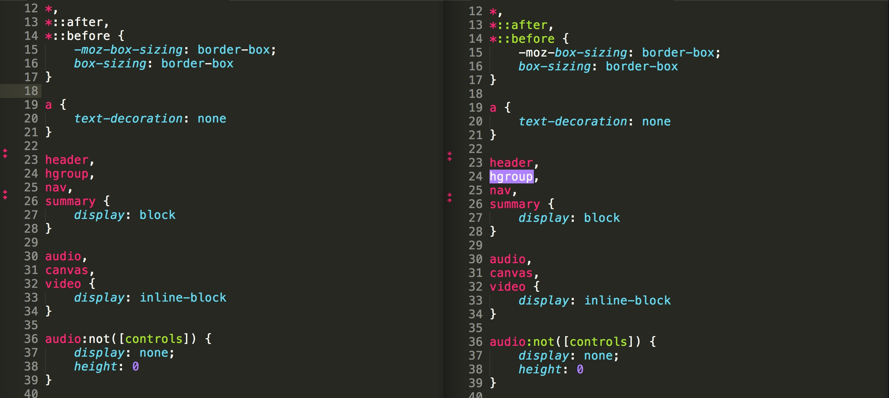
* [SCSS](https://sublime.wbond.net/packages/SCSS) - Разработчики, использующие Sass, должны установить плагины [SCSS](https://sublime.wbond.net/packages/SCSS) или [Sass](https://sublime.wbond.net/packages/Sass) (в зависимости от используемого синтаксиса). Обратите внимание на то, какой именно плагин вы установили. Распространённая ошибка — установить плагин Sass, но при этом использовать синтаксис SCSS, и наоборот.
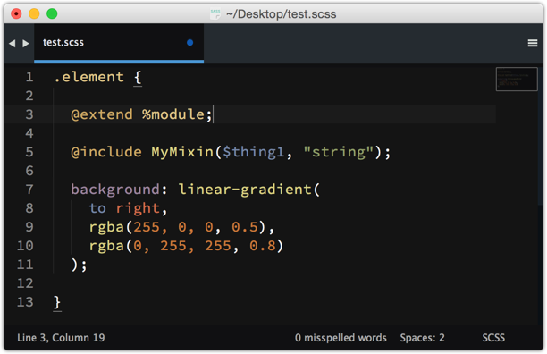
Разумеется, также существуют плагины для подсветки синтаксиса [Stylus](https://sublime.wbond.net/packages/Stylus) и [Less](https://sublime.wbond.net/packages/LESS).
* [Better CoffeeScript](https://packagecontrol.io/packages/Better%20CoffeeScript) - Пишете на CoffeeScript? Убедитесь, что у вас установлен плагин Better CoffeeScript. Важно использовать именно его, так как официальный плагин CoffeeScript больше не поддерживается его разработчиками.
* [TypeScript](https://packagecontrol.io/packages/TypeScript) - Также доступен плагин для подсветки синтаксиса TypeScript.
* [Haml](https://sublime.wbond.net/packages/Haml) - Плагин Haml расширяет стандартные возможности для работы с Haml и подсвечивает также код на других языках, записанный в haml-файле: JS, CSS, Sass и так далее.
* Плагины [Slim](https://sublime.wbond.net/packages/Ruby%20Slim) и [Jade](https://sublime.wbond.net/packages/Jade) добавляют возможность подсветки синтаксиса этих языков.
* [Color Highlighter](https://packagecontrol.io/packages/Color%20Highlighter) - При работе с таблицами стилей полезно иметь какое-то наглядное представление того, как выглядит тот или иной цвет. Color Highlighter будет сканировать вашу таблицу стилей и подсвечивать все цвета, закрашивая фон текста в тот цвет, который указан. Также есть возможность настроить плагин так, чтобы он подчёркивал цвета или ставил маркер нужного цвета слева от кода.
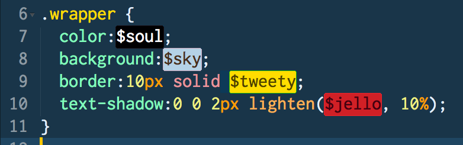
Недавно в Color Highlighter была добавлена поддержка Sass, Less и Stylus переменных, благодаря чему этот плагин становится пригодным практически для любого рабочего окружения.
* [Sublime Linter](http://www.sublimelinter.com/en/latest) - Проверка кода является весьма важной частью процесса разработки. Если вы никогда раньше не использовали linter, то знайте, что это инструмент для проверки качества кода. Он проверяет код на ошибки и использование плохих практик. С помощью Sublime Linter вы можете легко проверить практически любой код. Как фронтэндеры, мы должны проверять наш JavaScript и, по возможности, CSS. Если вы совершите ошибку в коде, Sublime Linter подсветит её небольшим красным кружком.
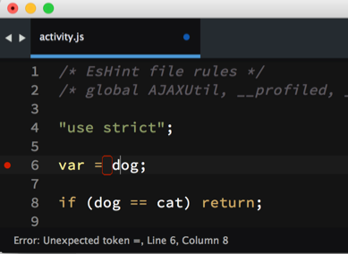
* [JavaScript & NodeJS Snippets](https://packagecontrol.io/packages/JavaScript%20%26%20NodeJS%20Snippets) - Коллекция сокращений сниппетов для JavaScript, которая поможет работать значительно быстрее. Зачем писать document.querySelector('selector’);, когда можно просто написать qs, нажать таб — и дело с концом!
* [Advanced New File](https://packagecontrol.io/packages/AdvancedNewFile) - С этим пакетом не придется лазить по деревьям каталогов и пользоваться выпадающими менюшками. Через cmd+alt+n (ctrl+alt+n) вызовется строка для ввода – вводим путь, имя файла, клацаем Enter. Готово!
* [Side Bar Enhancements](https://packagecontrol.io/packages/SideBarEnhancements) - Как и следует из названия, этот пакет добавит некоторые улучшения в левый сайдбар. Например, появятся пункт «Открыть в браузере», возможность сделать дубликат и еще около 20 полезных функций.
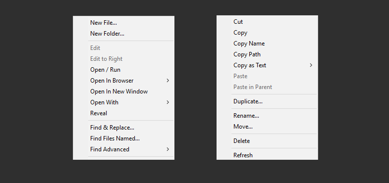
* [Placeholders](https://packagecontrol.io/packages/Placeholders) - В Sublime Text 3 появилась возможность генерировать и вставлять lorem ipsum, а Placeholder немного расширяет эту возможность. С ним можно вставлять макетные изображения, формы, списки и таблицы.
* [SublimeCodeIntel](https://packagecontrol.io/packages/SublimeCodeIntel) - Это расширение поможет быстрее разобраться в старом коде. При нажатии на имя функции покажет ссылку, по которой можно перепрыгнуть прямо к описанию этой функции.
* [Minify](https://packagecontrol.io/packages/Minify) - Минифицирует и создает в каталоге текущего файла его минифицированную версию. Работает с CSS, HTML, JavaScript, JSON и SVG. Для работы требует внешние node.js библиотеки, так что их придется установить отдельно:
`npm install -g clean-css uglifycss js-beautify html-minifier uglify-js minjson svgo`
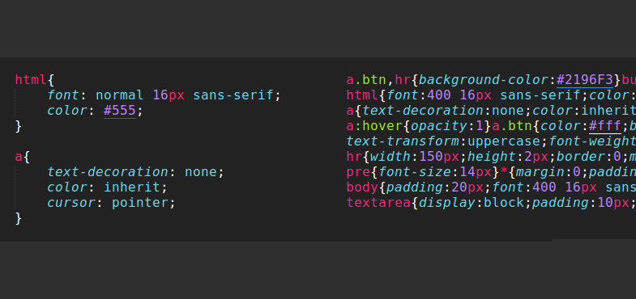
* [Angular​JS](https://packagecontrol.io/packages/AngularJS) - Для поддержки кода AngularJS
* [Type​Script](https://packagecontrol.io/packages/TypeScript) - Для поддержки кода Type​Script
* [Babel](https://packagecontrol.io/packages/Babel) - Для поддержки кода Babel
* *Terminal* - Этот плагин добавляет возможность открыть терминал в папке проекта прямо из Sublime Text с помощью горячей клавиши. Это очень полезно, если вам нужно выполнить какие-нибудь команды в этой папке.
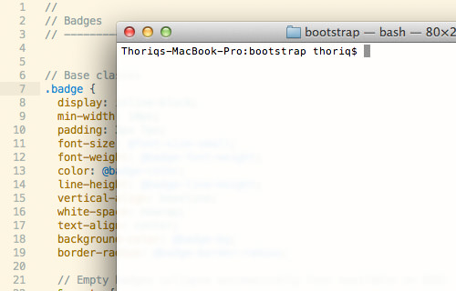
* *Can I Use* - С помощью этого плагина вы можете проверить поддержку браузером свойств CSS или HTML элементов, которые используете. Для того чтобы это сделать просто выделите свойство CSS или элемент HTML, после этого вы будете перенаправлены на соответствующую страницу caniuse.com.
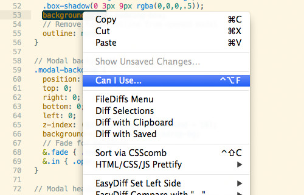
* *Alignment* - Плагин Alignment позволяет выровнять код, включая PHP, JavaScript и CSS. Это делает его аккуратным и более удобным для чтения. Пример вы можете увидеть на этом скриншоте:
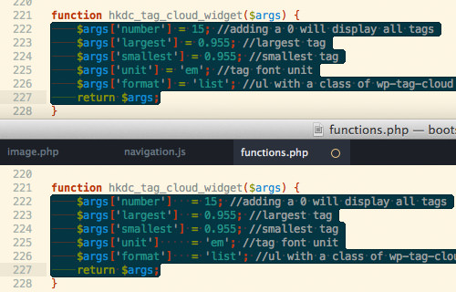
* FileDiffs - Плагин FileDiffs позволяет проанализировать различия между двумя файлами в Sublime Text 3. Вы можете сравнивать файлы не только между собой, но и с буфером обмена системы, а также не сохраненные и сохраненные версии одного файла.
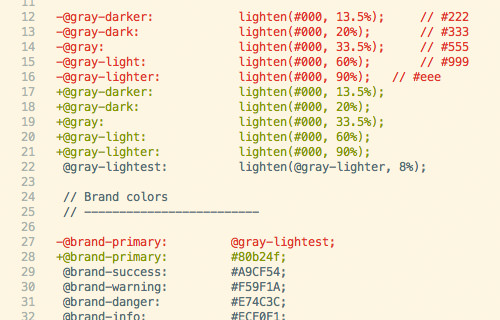
* [Sublime SFTP](http://wbond.net/sublime_packages/sftp) - Работа с FTP
* [FixMyJS](https://github.com/jshint/fixmyjs), [Jsfmt](https://github.com/paulirish/sublime-jsfmt) и [JsFormat](https://github.com/jdc0589/JsFormat) — плагины для форматирования JS/JSON-кода.
* [SVG-Snippets](https://github.com/jorgeatgu/SVG-Snippets) — большая коллекция полезных шаблонов при работы с SVG.
[]
* [ApplySyntax](https://github.com/facelessuser/ApplySyntax) — налету определяет синтаксис в текущем файле.
* [Clipboard History (ST2)](https://github.com/kemayo/sublime-text-2-clipboard-history) — плагин ведет историю буфера обмена, что позволяет вставить не только последний скопированный фрагмент кода, но и любой из предыдущих.

## Темы и Цветовые схемы для SublimeText

* [Solarized Dark](https://github.com/SublimeColors/Solarized) - это фантастическая тема, которая доступна во многих текстовых редакторах. Она стала любимой стандартной темой многих разработчиков.
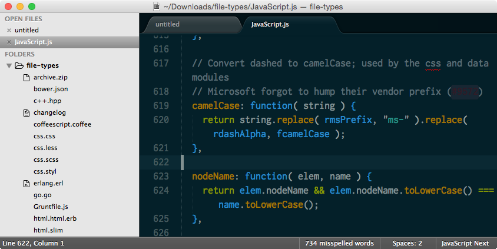
* [Cobalt2](https://github.com/wesbos/cobalt2) - Она основана на оригинальной теме Cobalt и имеет множество улучшений. Акцент в этой теме сделан на чистоте и ярком контрасте.
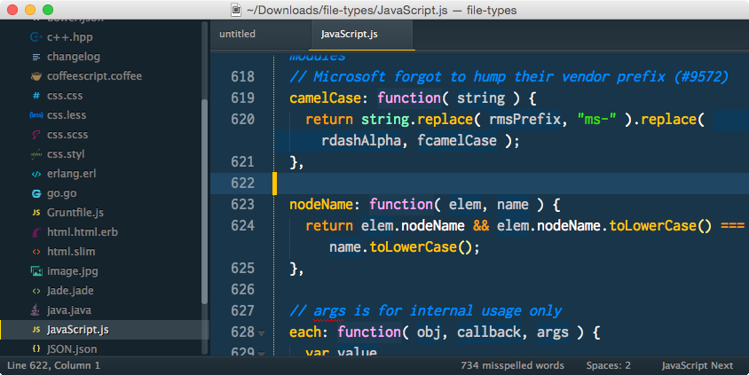
* [Seti UI](https://sublime.wbond.net/packages/Seti_UI) - Весьма молодая тема, имеющая тёмный дизайн с акцентом на синий цвет.
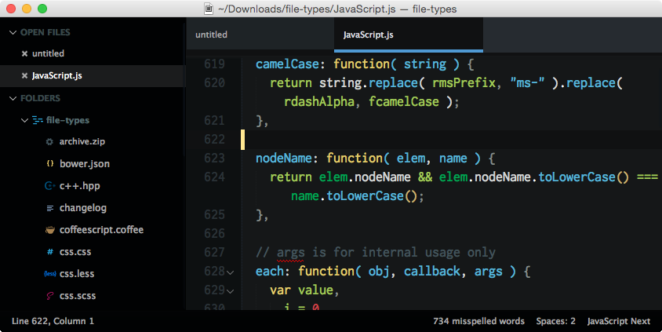